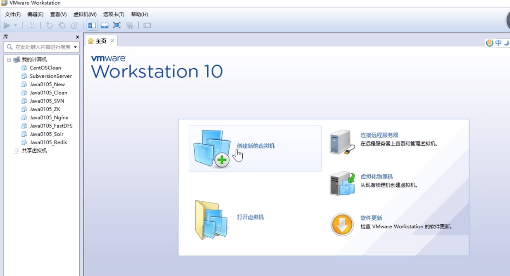
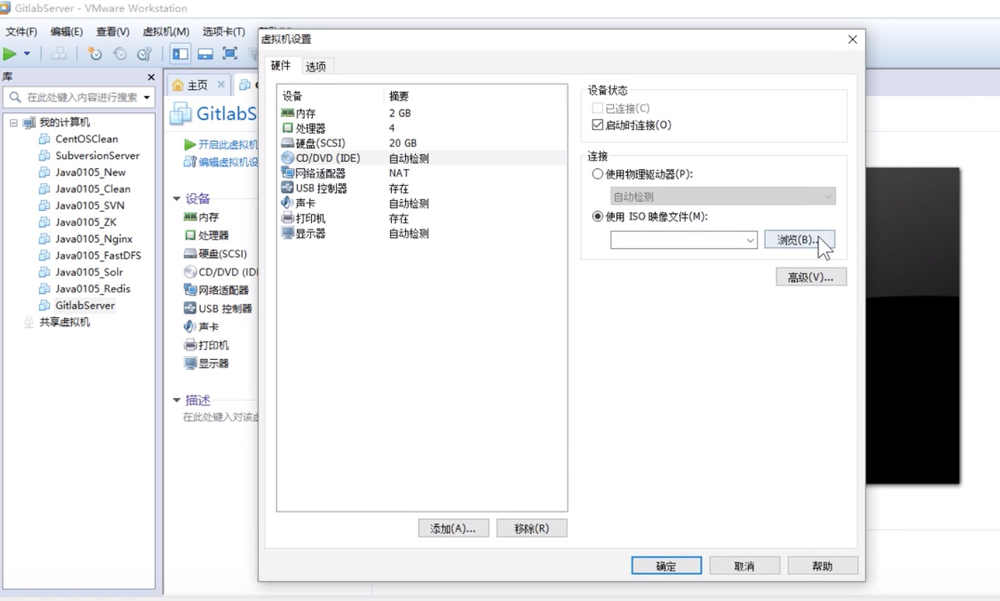
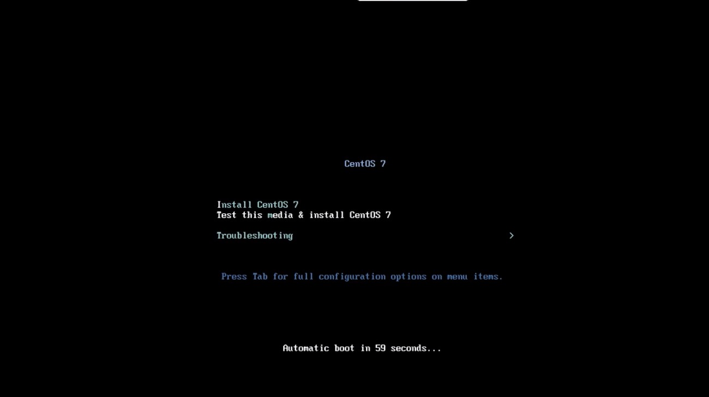
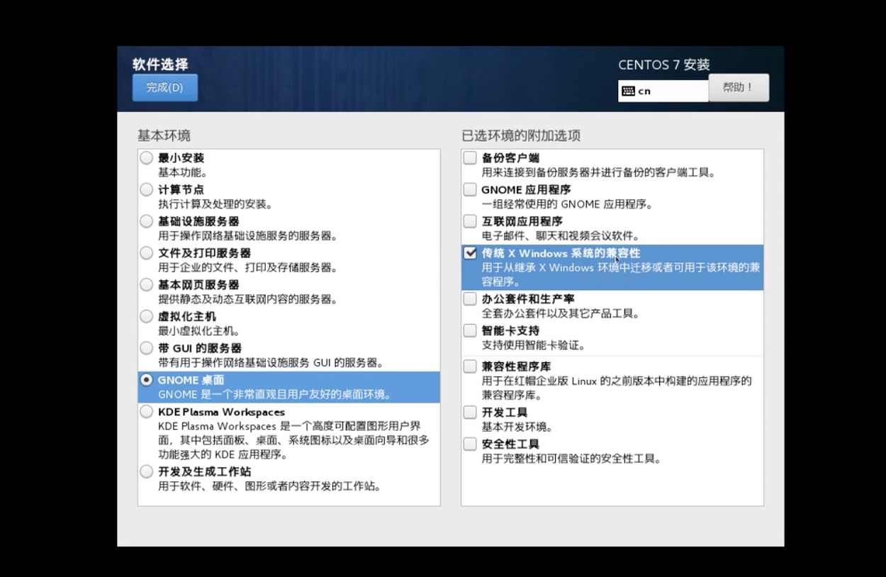
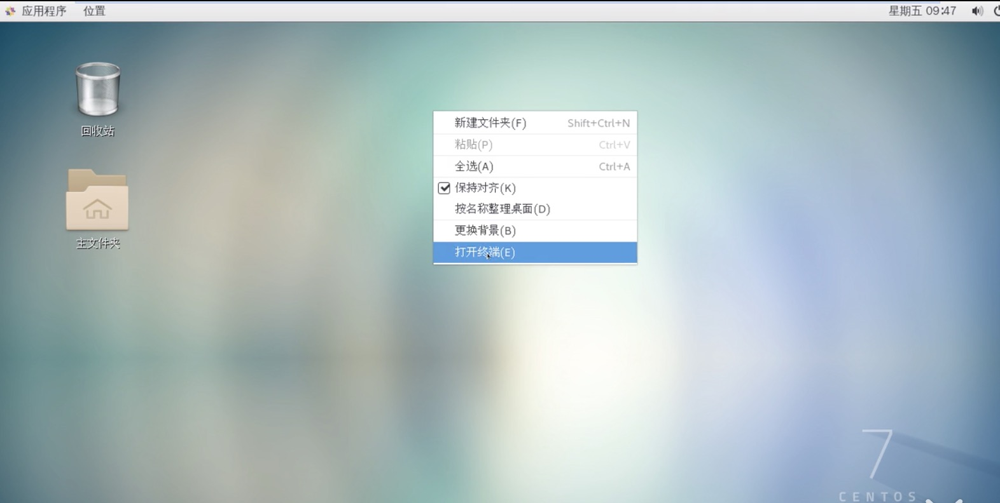
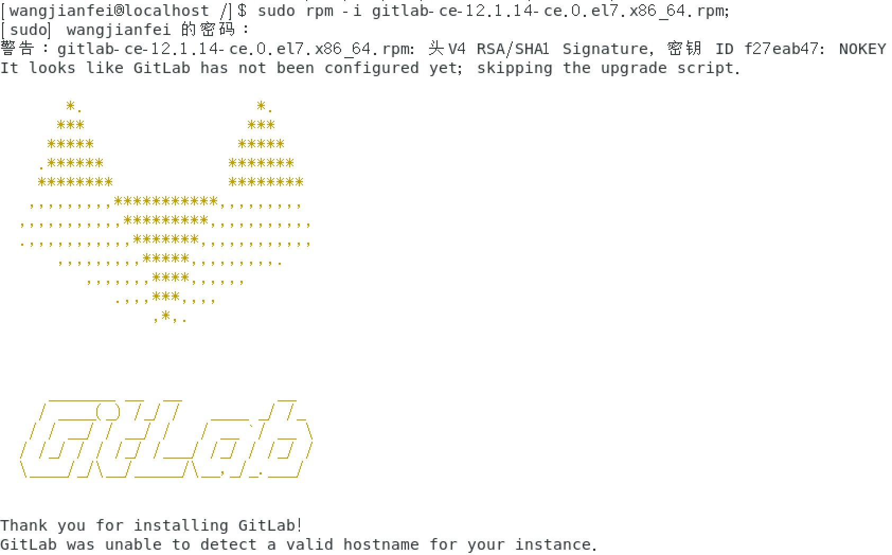
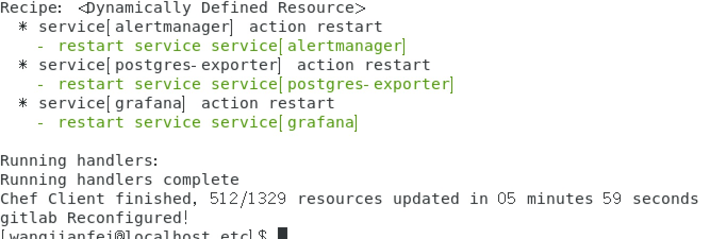
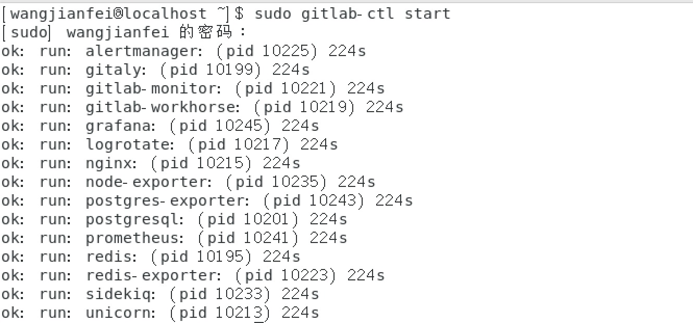
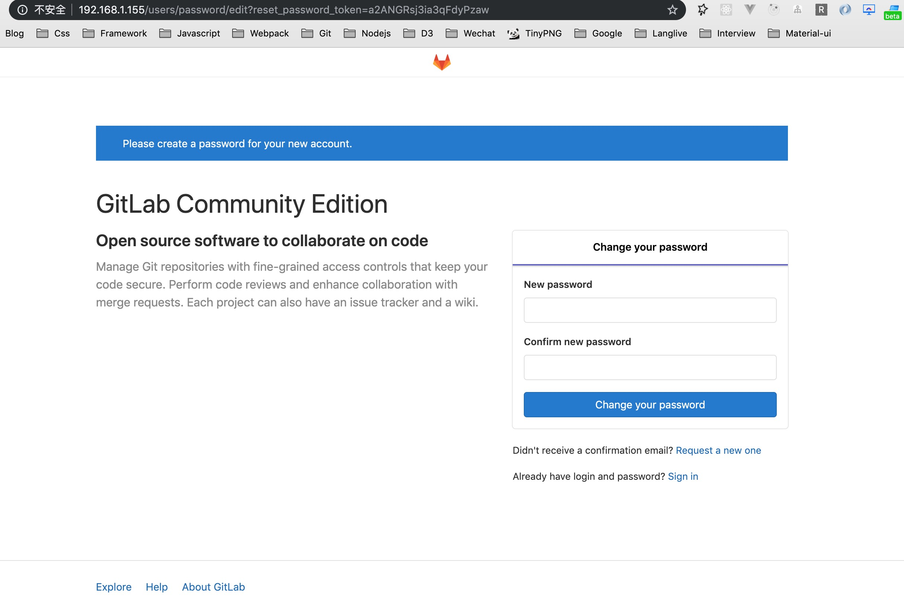
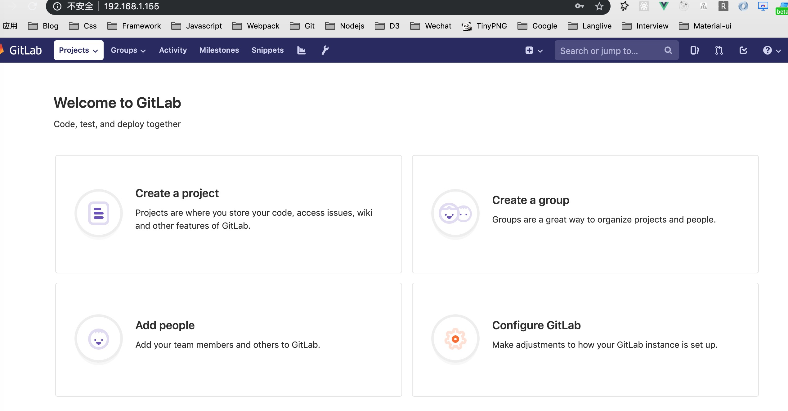

### 如何创建私有Gitlab仓库，方面公司内部托管私有代码(MAC/Windows类式)
> 思考：如何在一台电脑上运行两个系统？买新电脑--成本大！！安装双系统--只能运行一个系统！！虚拟机：同一台电脑借助虚拟机可以运行不同的操作系统，gitlab搭建在linux上比较方面快捷

> 一、安装VMware(创建虚拟机桌面应用工具)和centos7(linux发布的版本之一)

1. 下载VMware(外网相对较慢)，下载后进行安装，参考：[VMware](https://www.cnblogs.com/zhangycun/p/10932326.html)，[哔哩](https://www.bilibili.com/video/av24441039?p=56)。MAC安VMware装包百度网盘下载：链接:https://pan.baidu.com/s/18WbC5kzn_v22sDx-uEOeuw  密码:nft9

```
https://www.vmware.com/products/fusion/fusion-evaluation.html
```

2. Liunx系统镜像下载(CentOS 7): CentOS-7-x86_64-DVD-1908.iso ，下载后待备用,4个G太大(网盘有限制不然这里也提供了)自行下载(选择国内镜像地址下载也很快)

```
http://mirrors.aliyun.com/centos/7.7.1908/isos/x86_64/
```

3. 安装好VMware之后并允许信任软件，(Mac)将下载好的centos7---.iso拖至安装区域，进行安装,(Win)下选择创建虚拟机，把下载的Centos7路径导入(国内镜像地址：https://www.centos.org/download/mirrors/)，Win下示意图


上图创建过程需要设定虚拟机内存(建议内存4G，2个处理器)，一路下一步，然后CD/DVD(IDE)自动检测指定镜像文件(即上面下载的CentOS-7-x86_64-DVD-1908.iso路径)

确定之后开启此虚拟机，如下图，选择:install centos7，耐心等待

安装过程选择中文，软件选择记得勾选：GNOME-XWindows,等待检测后：开始安装，安装过程可以：创建root用户密码(记住)，安装完成之后：重启，同意许可一路前进

安装完成如图，接下来配置IP(可以访问外网，且局域网可以访问该虚拟机)，在虚拟机桌面右键打开终端继续第4步


4. 配置Centos7的IP，参考：[哔哩](https://www.bilibili.com/video/av24441039?p=56)。
```
// 进入目录
cd /etc/sysconfig/network-scripts/
// 查看目录
ll|less
// 默认配置文件是：ifcfg-ens33文件
ifcfg-ens33
// vim 打开编辑：主要是ip配置，保证虚拟机能正常联网

```

> 二、安装gitlab,官方教程：https://about.gitlab.com/install/#centos-7
注意：gitlab-ee应该是商业版，gitlab-ce应该是社区版本，以下使用gitlab-ce


1. 基础配置安装命令：centos7系统下的命令行执行

```
sudo yum install curl policycoreutils openssh-server openssh-clients
sudo systemctl enable sshd
sudo systemctl start sshd
sudo yum install postfix
sudo systemctl enable postfix
sudo systemctl start postfix
```

2 添加gitlab镜像(wget不存在要先安装：yum -y install wget)，此版本：gitlab-ce(2019-10-07 21:47),可以自行在清华大学开源镜像社区(https://mirrors.tuna.tsinghua.edu.cn/gitlab-ce/yum/el7/)查找最新的版本.

```
sudo wget https://mirrors.tuna.tsinghua.edu.cn/gitlab-ce/yum/el7/gitlab-ce-12.1.14-ce.0.el7.x86_64.rpm
```

3. 安装gitlab，安装成功入下图
```
sudo rpm -i gitlab-ce-12.1.14-ce.0.el7.x86_64.rpm
```



4. 配置gitlab(下面命令执行时间断断续续较长，不停的在action run...耐心等待~),完成入下图
```
sudo gitlab-ctl reconfigure
```



5. 启动gitlab服务，如下图

```
sudo gitlab-ctl start
```


6. 内网浏览器访问：此时就可以IP地址(上面安装centos7配置的IP)访问，如我的，若不能IP正常访问请停止centos内防火墙(生产不推荐)~
```
service firewalld stop
```



7. 后续操作，登录成功后(默认有个最开始root账号，也接受注册登录)的操作就和github界面差不多，就可以愉快的创建仓库管理私密代码了。如图



8. 停止gitlab服务
```
sudo gitlab-ctl stop
```

> 参考文档：[Gitlab](https://about.gitlab.com/install/#centos-7)，[cnblogs](https://www.cnblogs.com/wtil/p/11664153.html)，[尚硅谷](https://www.bilibili.com/video/av24441039?p=56)


> 注意：默认安装VMware时候分配的虚拟机内存是1G，这样在安装完gitlab之后可能犹豫内存不足导致的卡顿！解决参考：[百度经验](https://jingyan.baidu.com/article/86fae3460f83d83c49121a1c.html)